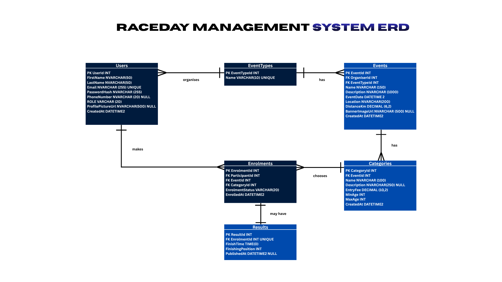
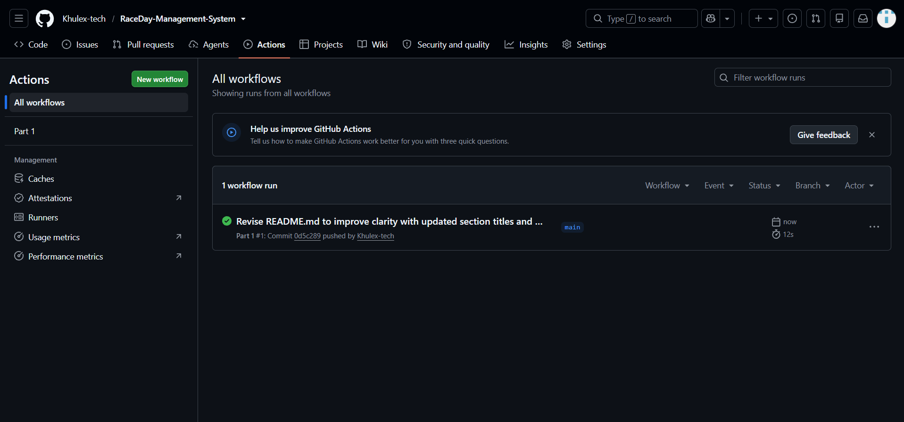

# RaceDay - Event Management System for South African Road Events

**Module:** PROG6212 - Programming 2B  
**Portfolio of Evidence - Part 1: System Planning and Database**  
**Repository:** RaceDay-Management-System

---

## 1. Project Overview

RaceDay is a web-based event management platform for South African road running, walking and cycling events. A lot of local races are still run with paper forms, spreadsheets and WhatsApp groups, so this project plans a proper system for organisers and participants.

Part 1 is planning and database work only. It covers:

- the system roles and how the app should work
- the Entity Relationship Diagram (ERD)
- the API endpoint plan for Part 2
- the SQL Server database script
- GitHub Actions checks for the Part 1 deliverables

No ASP.NET Core API or MVC front end has been built yet. That comes in Parts 2 and 3.

---


## 2. System Roles


| Role            | What the role can do                                                                                                                                                                                                                                                                                                                               |
| --------------- | -------------------------------------------------------------------------------------------------------------------------------------------------------------------------------------------------------------------------------------------------------------------------------------------------------------------------------------------------- |
| **Organiser**   | Register and log in. Create, edit and delete their own events (name, description, date, location, distance, event type). Define categories per event (name, description, entry fee, age range). View enrolments for their events, confirm or cancel enrolments, and capture finish times and finishing positions. Upload an event banner (Part 3). |
| **Participant** | Register and log in. Browse and view events with categories. Enter an event by selecting a category. View and update their own enrolments (withdraw or change category before race day). View personal race history (finish time and finishing position). Update their profile and upload a profile picture (Part 3).                              |


Both roles are stored in one `Users` table using a `Role` column (`Organiser` or `Participant`). In Part 2 the session will store `UserId` and `Role`. Organisers may only manage events they created. Participants may only manage their own enrolments and results.

---


## 3. Repository structure (`/docs` deliverables)

```
.
├── .github/
│   └── workflows/
│       └── part1.yml                 CI workflow that validates Part 1 deliverables
├── docs/
│   ├── RACEDAYERD.png                Section A — ERD (PNG)
│   ├── API_EndpointPlan.md           Section B — API endpoint plan (Markdown)
│   ├── RaceDay_DatabaseScript.sql    Section C — SQL Server schema + seed data
│   └── SUCCESSFUL-CI.png             Screenshot of a successful CI run
├── LICENSE
└── README.md
```


| Brief section | Requirement                                 | File in this repo                                                    |
| ------------- | ------------------------------------------- | -------------------------------------------------------------------- |
| **Section A** | ERD as PNG or PDF in `/docs`                | `[docs/RACEDAYERD.png](docs/RACEDAYERD.png)`                         |
| **Section B** | Endpoint plan as PDF or Markdown in `/docs` | `[docs/API_EndpointPlan.md](docs/API_EndpointPlan.md)`               |
| **Section C** | `.sql` script in `/docs`                    | `[docs/RaceDay_DatabaseScript.sql](docs/RaceDay_DatabaseScript.sql)` |


---


## 4. Section A — Entity Relationship Diagram (ERD)



### Brief requirements checklist


| Requirement                                                              | How this submission meets it                                                                                                           |
| ------------------------------------------------------------------------ | -------------------------------------------------------------------------------------------------------------------------------------- |
| Full RaceDay data model with a **minimum of six entities**               | **Six entities:** `Users`, `EventTypes`, `Events`, `Categories`, `Enrolments`, `Results`                                               |
| Show attributes, **primary keys**, **foreign keys**, and **cardinality** | Each entity lists attributes and types; PKs and FKs are labelled; crow's-foot notation shows one-to-many and the resolved many-to-many |
| Submit as **PNG or PDF** inside `/docs`                                  | Submitted as PNG: `docs/RACEDAYERD.png`                                                                                                |
| SQL script in Section C must **match the ERD exactly**                   | See Section C and the alignment note below — **no deliberate differences**                                                             |


### Entities


| Entity       | Purpose                                   | Key attributes                                                                                   |
| ------------ | ----------------------------------------- | ------------------------------------------------------------------------------------------------ |
| `Users`      | Organisers and Participants               | PK `UserId`; `Email` UNIQUE; `Role`; `PasswordHash`; optional `PhoneNumber`, `ProfilePictureUrl` |
| `EventTypes` | Run / Walk / Cycle                        | PK `EventTypeId`; `Name` UNIQUE                                                                  |
| `Events`     | Events owned by an Organiser              | PK `EventId`; FK `OrganiserId` → `Users`; FK `EventTypeId` → `EventTypes`                        |
| `Categories` | Entry options for an event                | PK `CategoryId`; FK `EventId` → `Events`; `EntryFee`, `MinAge`, `MaxAge`                         |
| `Enrolments` | Participant enters an event in a category | PK `EnrolmentId`; FKs `ParticipantId`, `EventId`, `CategoryId`; `EnrolmentStatus`                |
| `Results`    | Optional result for one enrolment         | PK `ResultId`; FK `EnrolmentId` UNIQUE → `Enrolments` (enforces 1:1)                             |


### Relationships and cardinality


| Relationship                        | Cardinality                         | Notes                                        |
| ----------------------------------- | ----------------------------------- | -------------------------------------------- |
| `Users` (as Organiser) → `Events`   | **One-to-many**                     | One Organiser organises many events          |
| `EventTypes` → `Events`             | **One-to-many**                     | One type has many events                     |
| `Events` → `Categories`             | **One-to-many**                     | One event has many categories                |
| `Users` (as Participant) ↔ `Events` | **Many-to-many** (via `Enrolments`) | Resolved by the `Enrolments` junction entity |
| `Categories` → `Enrolments`         | **One-to-many**                     | One category is chosen by many enrolments    |
| `Enrolments` → `Results`            | **One-to-one** (optional)           | An enrolment may have one result             |


**Design notes**

1. **Many-to-many via** `Enrolments`**:** Participants and events cannot be linked directly. `Enrolments` stores `CategoryId` and `EnrolmentStatus` as well as the two FKs.
2. `Results` **hangs off** `Enrolments`**:** A result cannot exist without an enrolment; `UNIQUE(EnrolmentId)` enforces at most one result per enrolment.

---


## 5. Section B — API Endpoint Plan

**Deliverable:** `[docs/API_EndpointPlan.md](docs/API_EndpointPlan.md)`

The endpoint plan was written before any Part 2 API code. It is the contract the ASP.NET Core Web API will follow later.

### Brief requirements checklist


| Requirement                                                                                                                  | How this submission meets it                                          |
| ---------------------------------------------------------------------------------------------------------------------------- | --------------------------------------------------------------------- |
| Table completed **before** Part 2 code                                                                                       | Plan is ready; no API project code is in this repo yet                |
| Columns: **HTTP Method, Route, Description, Role Required, Request Body, Expected Response**                                 | Every endpoint row in `API_EndpointPlan.md` uses those six columns    |
| Cover **Authentication** (register & login), **User Profile**, **Events**, **Categories**, **Event Enrolments**, **Results** | These areas are covered in the plan (plus a few supporting endpoints) |
| Submit as **PDF or Markdown** in `/docs`                                                                                     | Submitted as Markdown: `docs/API_EndpointPlan.md`                     |
| Part 2 API must closely match this plan                                                                                      | Part 2 will be built against this document                            |


### Resource groups planned


| Resource group   | Covered in plan | Examples from the plan                                           |
| ---------------- | --------------- | ---------------------------------------------------------------- |
| Authentication   | Yes             | `POST /api/auth/register`, `POST /api/auth/login`                |
| User Profile     | Yes             | `GET/PUT /api/users/profile`, password change, profile picture   |
| Events           | Yes             | List, detail, create, update, delete, banner upload, event types |
| Categories       | Yes             | Categories nested under events, plus category CRUD               |
| Event Enrolments | Yes             | Enter event, my enrolments, status/category updates, withdraw    |
| Results          | Yes             | Capture, update, delete, event results, my results               |


Role values in the plan are **None** (public), **Any** (logged in), **Organiser** or **Participant**. Routes start with `/api/`.

Full endpoint details are in `[docs/API_EndpointPlan.md](docs/API_EndpointPlan.md)`.

---


## 6. Section C — SQL Database Script

**Deliverable:** `[docs/RaceDay_DatabaseScript.sql](docs/RaceDay_DatabaseScript.sql)`

The script creates the RaceDay database in SQL Server Management Studio. It drops and recreates `RaceDayDb`, so it can be run again on a clean instance.

### Brief requirements checklist


| Requirement                                                                                                  | How this submission meets it                                                                   |
| ------------------------------------------------------------------------------------------------------------ | ---------------------------------------------------------------------------------------------- |
| `CREATE TABLE` for **every entity in the ERD**                                                               | Creates all six tables: `Users`, `EventTypes`, `Events`, `Categories`, `Enrolments`, `Results` |
| **Primary keys, foreign keys**, and constraints (`NOT NULL`, `UNIQUE`, `DEFAULT`)                            | Defined in the script (plus `CHECK` constraints where needed)                                  |
| Seed data: **≥ 2 Organisers**, **≥ 2 Participants**, **≥ 3 Events**, categories per event, sample enrolments | Seeded as shown below                                                                          |
| Saved as `.sql` in `/docs`                                                                                   | `docs/RaceDay_DatabaseScript.sql`                                                              |
| Runs without errors on a **clean SQL Server** instance                                                       | Script drops/recreates `RaceDayDb`, then creates schema and seeds data                         |


### Sample data in the script

These counts come from the `INSERT` statements in `RaceDay_DatabaseScript.sql`:


| Seed item    | Count | Detail                                                                                     |
| ------------ | ----- | ------------------------------------------------------------------------------------------ |
| Organisers   | 2     | Thabo Mokoena, Ayesha Patel                                                                |
| Participants | 4     | Sipho, Lerato, Johan, Nomvula                                                              |
| Events       | 3     | Soweto Marathon (Run), Cape Town Cycle Tour (Cycle), Durban Beachfront Charity Walk (Walk) |
| Categories   | 10    | Categories across all three events                                                         |
| Enrolments   | 8     | Includes Pending, Confirmed and Cancelled                                                  |
| Results      | 3     | Finish times and finishing positions for completed enrolments                              |


### How to run (SSMS)

1. Open `docs/RaceDay_DatabaseScript.sql` in SQL Server Management Studio.
2. Connect to a clean SQL Server instance.
3. Execute the full script (F5).
4. Check the `SELECT` statements at the end (row counts, enrolments, results).

Or from the command line:

```bash
sqlcmd -S "(localdb)\MSSQLLocalDB" -i "docs/RaceDay_DatabaseScript.sql"
```

---


## 7. ERD and SQL alignment (Section A ↔ Section C)

The brief says the SQL script must match the ERD exactly, and any deliberate differences must be explained here.

**There are no deliberate differences.** `RaceDay_DatabaseScript.sql` matches `docs/RACEDAYERD.png` for:

- the same six entities;
- the same attributes and data types used in the diagram;
- the same primary keys and foreign keys;
- the same relationships and cardinality (including the optional 1:1 between `Enrolments` and `Results` through `UNIQUE EnrolmentId`).

---


## 8. CI/CD

GitHub Actions runs `[.github/workflows/part1.yml](.github/workflows/part1.yml)` on pushes to `main`/`master` and on pull requests.

This workflow does **static / structural checks only**. It does **not** start a SQL Server container or execute the SQL script inside Actions.

It checks that:

- `docs/` and `.github/workflows/` exist;
- `README.md`, `docs/RACEDAYERD.png`, `docs/API_EndpointPlan.md` and `docs/RaceDay_DatabaseScript.sql` are present;
- the ERD file is a non-empty PNG;
- the endpoint plan includes the six required columns and covers Authentication, User Profile, Events, Categories, Enrolments and Results;
- the SQL script contains `CREATE TABLE` for all six entities, plus `PRIMARY KEY`, `FOREIGN KEY`, `NOT NULL`, `UNIQUE`, `DEFAULT`, `CHECK` and seed `INSERT` statements;
- the README includes Project Overview, System Roles and CI/CD.

Screenshot of a successful Part 1 CI run:



---


## 9. GitHub and version control

This repository is hosted on GitHub as **RaceDay-Management-System**.

Part 1 work is meant to show planning progress through normal commits (ERD, endpoint plan, SQL script, README and CI updates). The brief expects a meaningful commit history (20+ commits across the portfolio). Commits should describe real changes, not empty or junk messages.

---


## 10. Next steps


| Part       | Focus                                                                                |
| ---------- | ------------------------------------------------------------------------------------ |
| **Part 2** | ASP.NET Core Web API implementing `API_EndpointPlan.md` against `RaceDayDb`          |
| **Part 3** | MVC front end, file uploads (profile picture and event banner), and Docker packaging |


---

## 11. Author

**Name:** Thapelo Mkhari (Khulex-tech)  
**Module:** PROG6212 - Programming 2B  
**Part:** 1 of 3 - System Planning and Database